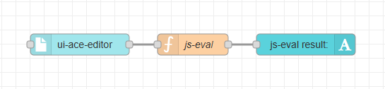
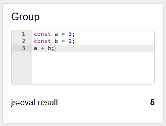

# node-red-dashboard-2-ui-ace-editor

A code editor widget with Ace for Node-RED Dashboard 2.0.




## Installation

You can install this node from the "Manage Palette" menu in the Node-RED interface.
Alternatively, run the following command in your Node-RED user directory:

```
npm install @yoshoku/node-red-dashboard-2-ui-ace-editor
```

## License

node-red-dashboard-2-ui-ace-editor is available as open source under the terms of
the [Apache-2.0 License](https://github.com/yoshoku/node-red-dashboard-2-ui-ace-editor/blob/main/LICENSE).
